# Getaviz Filter: User Guide

## Inhalt

1. Überblick
2. Filter  
  - User Interface
    - Toolbar
    - Container
    - Ebene
  - Selektion
    - Queries
    - Selektionsmanipulatoren
  - Transformationen
    - Sichtbarkeit
    - Transparenz
    - Auswahl
    - Konnektivität
3. Typischer Wokrflow
4. Anhang
  - Entwicklermodus

## Überblick

> Getaviz is a toolset for designing, generating, and exploring software visualizations in 2D, 3D, and virtual reality (VR), supporting structural, behavioral and evolutional visualizations. ([Getaviz on Github](https://github.com/StefanFaulhaber/Getaviz))

Das User Interface von Getaviz zum Erkunden von Visualisierungen läuft im Browser. Es wird stetig weiterentwickelt, um die Benutzererfahrung zu verbessern. Im Zuge meiner Masterarbeit habe ich einen Filter in Form eines Plugins für das User Interface entwickelt. Dieser User Guide ist eine kurze Einführung in die Funktionsweise dieses Filters.

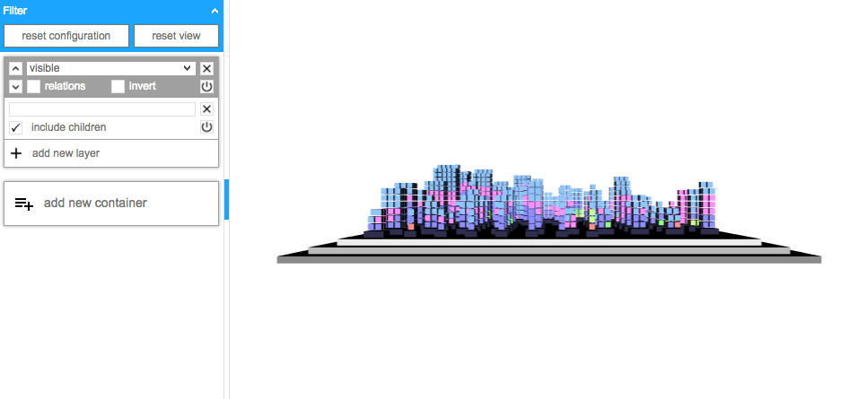  
User Interface mit Filter (links) und Visualisierung (rechts)

## Filter

Der Filter hat die Hauptfunktion, komplexe Visualisierungen verständlicher zu machen. Dazu können beispielsweise Teile der Visualisierung ausgeblendet werden oder Beziehungen zwischen Glyphen der Visualisierung eingeblendet werden.

### User Interface

Nach jeder Änderung der Filterkonfiguration wird der Filter automatisch angewendet. Die Startkonfiguration blendet automatisch alle Glyphen der Visualisierung ein und repräsentiert damit eine ungefilterte Visualisierung.

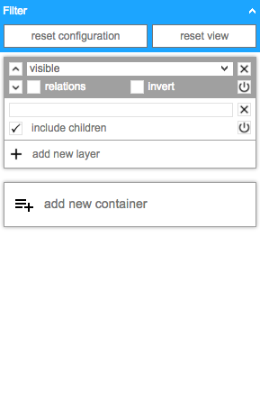  
User Interface des Filters

#### Toolbar

Am oberen Rand des Filters befindet sich die Toolbar, die zwei Aktionen zum Zurücksetzen beinhaltet. Während `reset configuration` die Konfiguration auf den Standard zurücksetzt, setzt `reset view` den Zoom und die Orientierung der Visualisierung zurück.

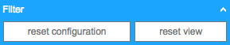  
Toolbar

#### Container

Ein Container bildet die Einheit aus einer Transformation und den Ebenen, die Glyphen selektieren. Ein Container kann beliebig viele Ebenen beinhalten und es können beliebig viele Container über `add new container` hinzugefügt werden. Der Filter wird dabei von oben nach unten ausgewertet, das heißt der oberste Container wird zuerst angewendet, bevor  alle weiteren angewendet werden.

Deaktivierte Container werden dabei übersprungen (`IO` Button) und ungenutzte Container können gelöscht werden (`X` Button).

Über die Pfeile in der linken oberen Ecke des Containers kann seine Position geändert werden. 

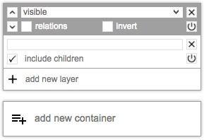  
Containerbereich

#### Ebene

Eine Ebene enthält ein Query-Feld für die Eingabe eines Fully Qualified Names (FQN), der einen Glyphen bezeichnet. Weiterhin kann über `include children` angegeben werden, ob die Glyph mit allen Kind-Elementen selektiert werden soll (sinnvoll für Pakete und Klassen). Wie ein Container kann auch eine Ebene deaktiviert (`IO`) oder gelöscht (`X`) werden.

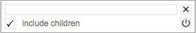  
Ebene eines Containers

### Selektion

Jeder Container selektiert bestimmte Glyphen und wendet seine Transformation auf diese Selektion an. Daher ist es von Bedeutung, dass die Selektion möglichst präzise erstellt werden kann.

#### Queries

Um die Selektion von Glyphen zu erleichtern, enthält der Filter eine Autovervollständigung, wie man sie aus Suchmaschinen kennt. Die Autovervollständigung zieht vorherige Container mit in Betracht, indem sie ausgeblendete Glyphen nicht mehr vorschlägt. So können Tippfehler vermieden und Glyphen schneller selektiert werden.

Durch die Vorschläge kann mit den Pfeiltasten der Tastatur navigiert werden. Mit Enter wird der fokussierte Vorschlag als Query eingetragen.

Eine leere Query steht dabei für die Selektion aller auswählbaren Glyphen. Ein Beispiel dafür ist die Standardkonfiguration: Ein Container mit der Transformation `visible` der eine Ebene enthält deren Query leer ist. Damit werden alle Glyphen der Visualisierung selektiert und sichtbar gemacht.

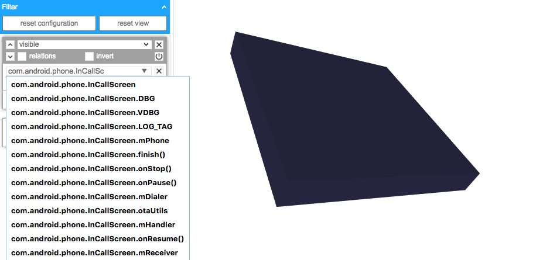
Query mit Autovervollständigung

#### Selektionsmanipulatoren

Um einer Containerselektion weitere Eigenschaften zu verleihen, kann diese mit den Selektionsmanipulatoren `relations` und `invert` beeinflusst werden.

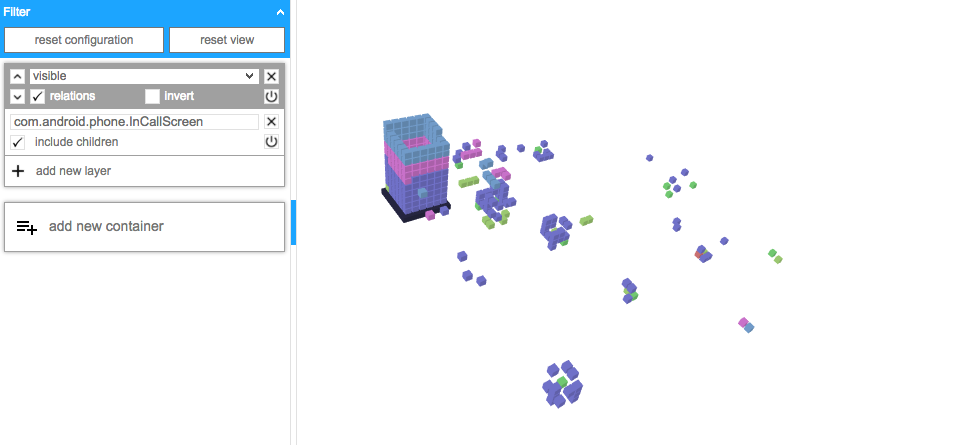  
`relations`: selektiert zusätzlich alle Relationen (istSubtyp, istSupertyp, wirdAufgerufen, ruftAuf, ...)

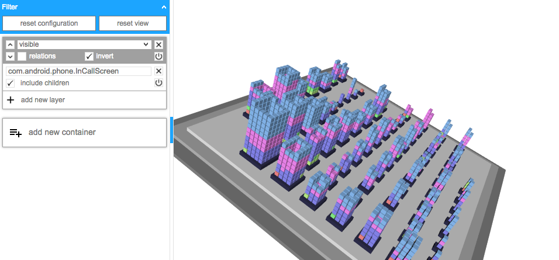  
`invert`: selektiert alle Glyphen der Visualisierung, außer der Gesamtauswahl des Containers

### Transformationen

Eine Transformation bestimmt, wie der Filter mit der Selektion eines Containers umgeht.  

Liste aller Transformationen:
- `visible`
- `invisible`
- `transparent`
- `intransparent`
- `selected`
- `connected`

#### Sichtbarkeit

Die Transformationen `visible` und `invisible` können Glyphen anzeigen oder ausblenden.

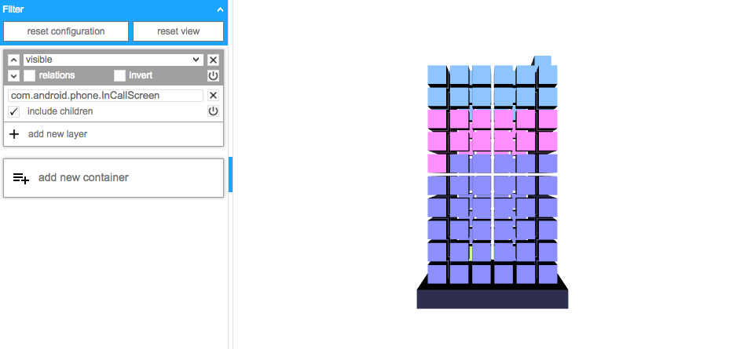  

#### Transparenz

Die Transformationen `transparent` und `intransparent` können Glyphen respektive durchsichtig oder undurchsichtig darstellen.

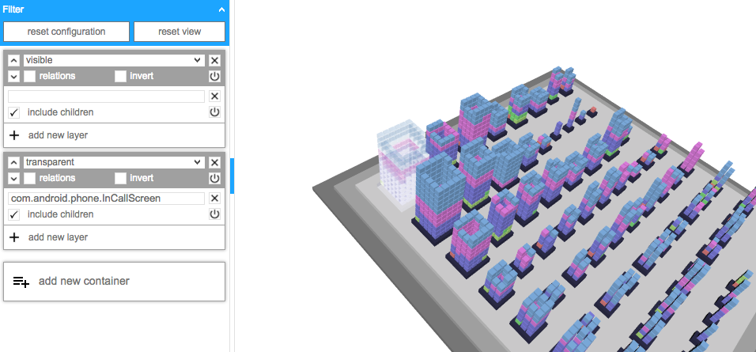  

#### Auswahl

Die Transformation `selected` kann Glyphen auswählen.

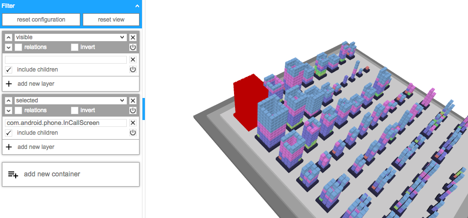  

#### Konnektivität

Die Transformation `connected` verbindet alle Relationen innerhalb der Selektion mit Konnektoren und färbt die an den Relationen teilhabenden Glyphen ein. Diese Transformation lässt sich kombinieren mit der Selektionsmanipulation `relations`.

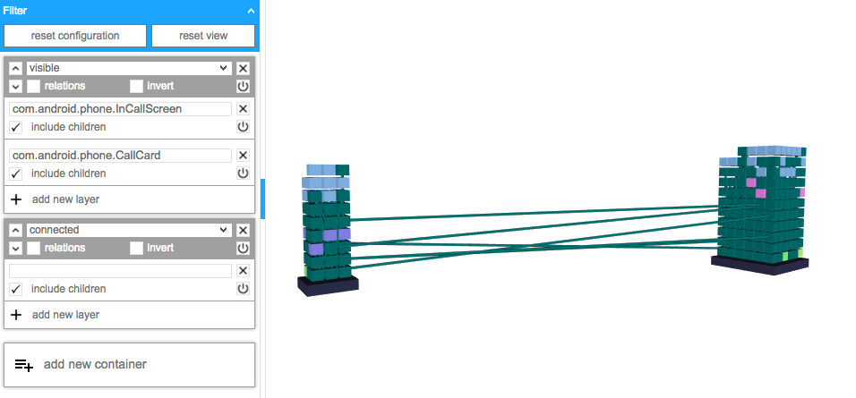  
Darstellung der Klassen `InCallScreen` und `CallCard` mit gleichzeitiger Anzeige aller Relationen zwischen ihnen

## Typischer Workflow

1. Anzeigen der relevanten Glyphen
    - Ausschluss von Glyphen mit der Transformation `invisible`
    - Einblenden von Glyphen mit der Transformation `visible`
    - eventuell Relationen beachten

2. Glyphen priorisieren
    - Glyphen mit der Transformation `transparent` in den Hintergrund treten lassen
    - Glyphen mit der Transformation `intransparent` herausstellen

3. Relationen anzeigen
    - Glyphenrelationen mit der Transformation `connected` anzeigen

4. Besonderheiten kennzeichnen
    - Glyphen mit der Transformation `selected` markieren

## Anhang

### Entwicklermodus

Der Entwicklermodus bietet noch weitere Funktionen:
- Laden von Konfigurationsdateien
- Speichern von Konfigurationen
- manuelles Anwenden des Filters
- Loggen des Konfigurationsobjekts zur Fehlerbehebung

Der Entwicklermodus kann im Setup über die Variable `devMode` eingeschalten werden. Außerdem kann dort auch die Anfangskonfiguration des Filters über die Variable `configuration` geändert werden. Die Konfigurationsdatei muss sich dazu im Ordner `/scripts/Filter/Configurations/` befinden.

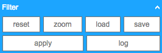  
Toolbar des Filters im Entwicklermodus