# Getaviz UI: Filter Dokumentation

## Überblick

Kurzer Einleitungstext: 
- Getaviz
- UI
- Filter Einordnung
- UI Screenshot mit Grobaufteilung (1)
- 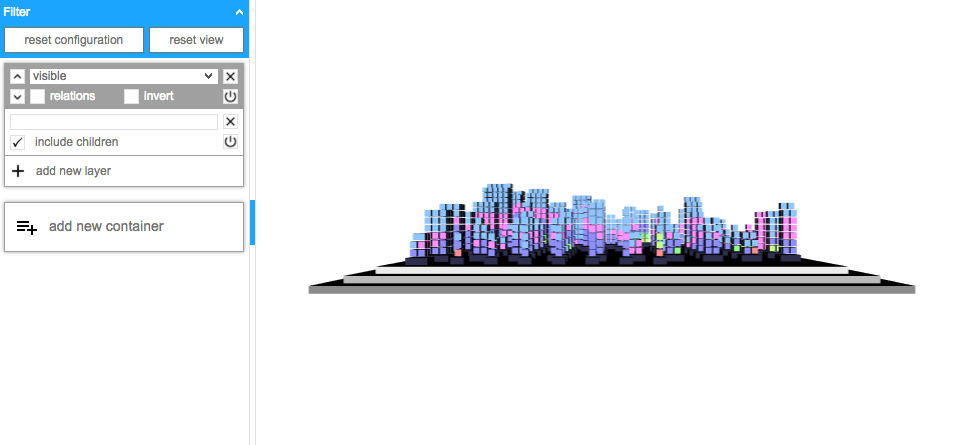

## Filter

- kurzer Einleitungstext

### User Interface

- Allgemeines (2)
- 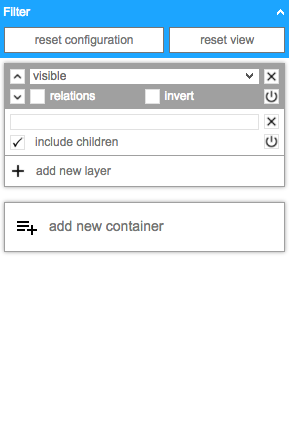

#### Toolbar

- Erklärung der Funktionen (3)
- 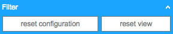

#### Container

- UI Screenshot mit Erklärung (4)
- 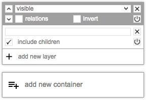

#### Layer

- UI Screenshot mit Erklärung (5)
- 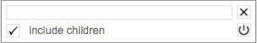

### Auswahl

- Allgemeines

#### Queries

- Screenshot mit Beispiel & Erklärung (6)
- 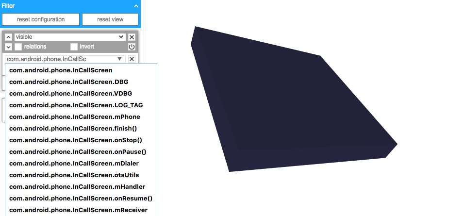

#### Auswahlmanipulatoren

- Screenshot mit Beispiel & Erklärung (7)
- 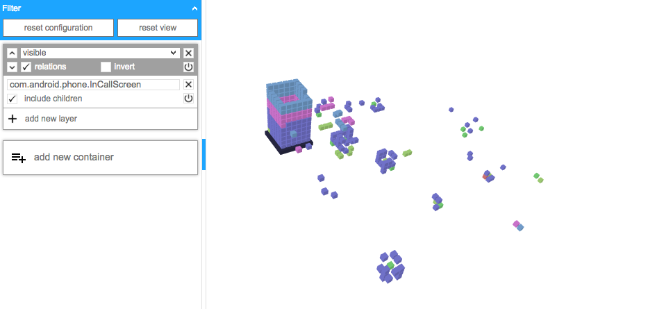
- Screenshot mit Beispiel & Erklärung (8)
- 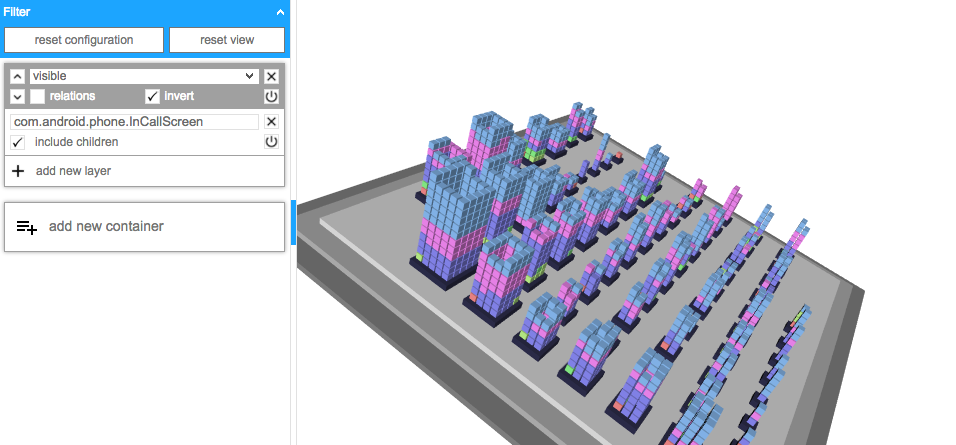

### Transformationen

- Allgemeines

#### Sichtbarkeit

- Screenshot mit Beispiel & Erklärung (9)
- 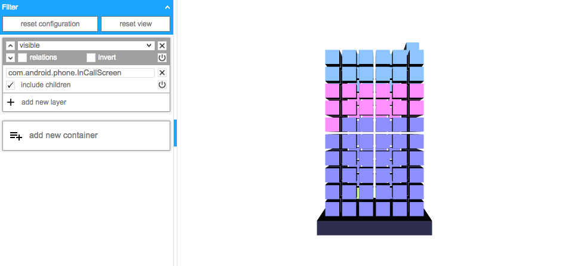

#### Transparenz

- Screenshot mit Beispiel & Erklärung (10)
- 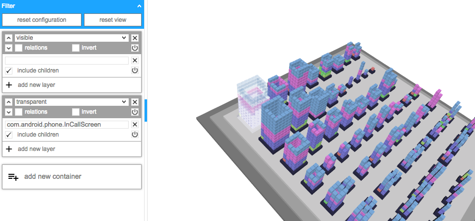

#### Selektion

- Screenshot mit Beispiel & Erklärung (11)
- 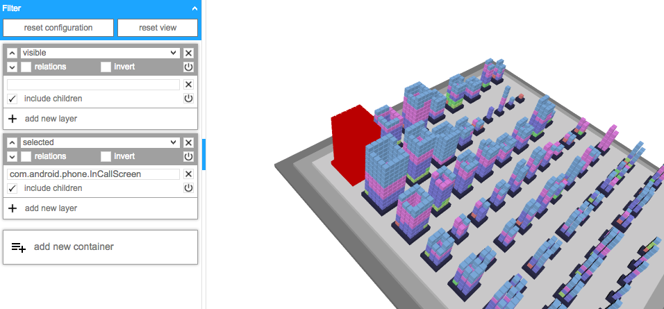

#### Konnektivität

- Screenshot mit Beispiel & Erklärung (12)
- 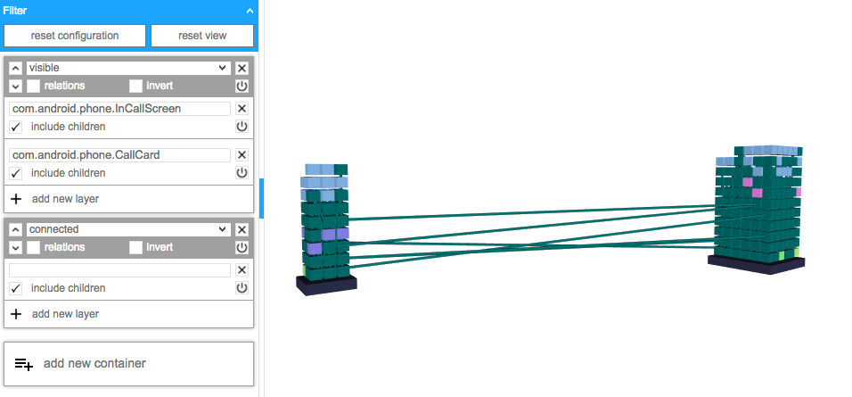

### Entwicklermodus

- devMode Erklärung mit Screenshot (13)
- 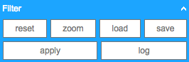